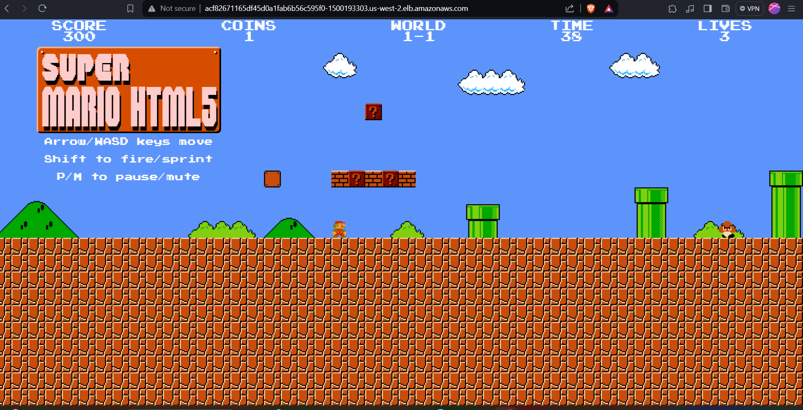

# Mario Game Deployment on AWS EKS Cluster

This project demonstrates the deployment of a Mario game application on an AWS EKS cluster. It involves the following steps:
## Prerequisites

Before starting, ensure you have the following installed on your local machine:
- Terraform
- kubectl
- AWS CLI
- We also need the appropriate IAM permissions for provisioning resources.

1. **Instance Setup**:
   - Provision an EC2 instance on AWS.
   - Install necessary tools using a shell script (`script.sh`):
     - Git
     - Docker
     - AWS CLI
     - Terraform
     - kubectl

2. **EKS Cluster Creation**:
   - Use Terraform to create an AWS EKS cluster (`main.tf`).
     - terraform init
     - terraform validate 
     - terraform fmt 
     - terraform plan
     - terraform apply -auto-approve

3. **Deployment**:
   - Deploy the Mario game application on the EKS cluster using Kubernetes manifests (`deployment.yaml`, `service.yaml`).


## Usage

```bash
1. Initialize Terraform:
   terraform init

2. Apply the Terraform configuration to create the EKS cluster:
   terraform apply

3. Configure `kubectl` to connect to the EKS cluster:
   aws eks --region <region> update-kubeconfig --name <cluster-name>

4. Deploy the Mario game application using the Kubernetes manifests:
   kubectl apply -f deployment.yml
   kubectl apply -f service.yml

5. Monitor the deployment and service using:
   kubectl get pods
   kubectl get services

6. Access the deployed Mario game application through the service endpoint.
   kubectl describe service mario-service 
   (We get the load blancer ingress copy that and paste it in local browser and enjoy the game!!!).
```



